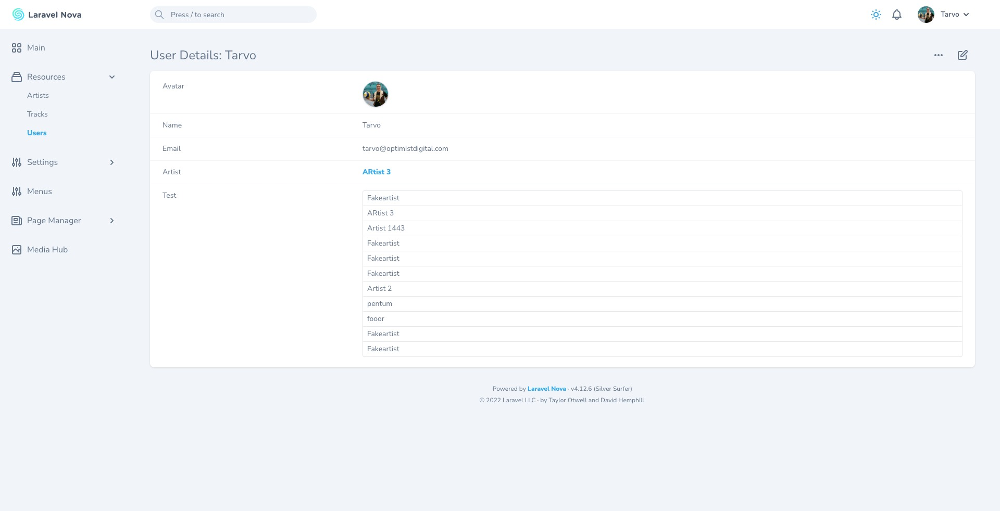
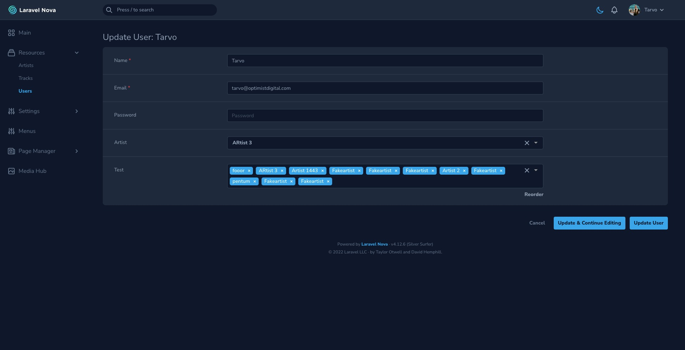

# Nova Multiselect

[](https://packagist.org/packages/outl1ne/nova-multiselect-field)
[](https://packagist.org/packages/outl1ne/nova-multiselect-field)

This [Laravel Nova](https://nova.laravel.com) package adds a multiselect to Nova's arsenal of fields.

## Requirements

- `php: >=8.0`
- `laravel/nova: ^4.1`

## Features

- Multi- and singleselect with search
- Asynchronous search
- Reordering functionality with drag & drop
- Dependency on other Multiselect instances
- Distinct values between multiple multiselects
- Fully compatible with light and dark modes

## Screenshots





## Installation

Install the package in a Laravel Nova project via Composer:

```bash
composer require outl1ne/nova-multiselect-field
```

## Usage

The field is used similarly to Nova's native Select field. The field type in the database should be text-based (ie `string`, `text` or `varchar`), selected values are stored as a stringified JSON array.

```php
use Outl1ne\MultiselectField\Multiselect;

public function fields(Request $request)
{
    return [
      Multiselect::make('Football teams')
        ->options([
          'liverpool' => 'Liverpool FC',
          'tottenham' => 'Tottenham Hotspur',
        ])

        // Optional:
        ->placeholder('Choose football teams') // Placeholder text
        ->max(4) // Maximum number of items the user can choose
        ->saveAsJSON() // Saves value as JSON if the database column is of JSON type
        ->optionsLimit(5) // How many items to display at once
        ->reorderable() // Allows reordering functionality
        ->singleSelect() // If you want a searchable single select field
        ->distinct('football') // Disables values used by other multiselects in same distinct group
        ->taggable() // Possible to add values ("tags") on the fly

        // Async model querying
        Multiselect::make('Artists')
          ->asyncResource(Artist::class),

          // If you want a custom search, create your own endpoint:
          ->api('/api/multiselect/artists?something=false', Artist::class),
    ];
}
```

### Option groups

Option groups are supported. Their syntax is the same as [Laravel's option group syntax](https://nova.laravel.com/docs/2.0/resources/fields.html#select-field).

In this example (from Nova docs), all values are grouped by the `group` key:

```php
->options([
    'MS' => ['label' => 'Small', 'group' => 'Men Sizes'],
    'MM' => ['label' => 'Medium', 'group' => 'Men Sizes'],
    'WS' => ['label' => 'Small', 'group' => 'Women Sizes'],
    'WM' => ['label' => 'Medium', 'group' => 'Women Sizes'],
])
```

### Dependencies

You can make a Multiselect depend on another by using `optionsDependOn`. The value from the `optionsDependOn` Multiselect has to be the key to the options and the value must be a key-value dictionary of options as usual.

Usage:

```php
Multiselect::make('Country', 'country')
    ->options([
        'IT' => 'Italy',
        'SG' => 'Singapore',
    ]),

Multiselect::make('Language', 'language')
    ->optionsDependOn('country', [
        'IT' => [
            'it' => 'Italian',
        ],
        'SG' => [
            'en' => 'English',
            'ms' => 'Malay',
            'zh' => 'Chinese',
        ]
    ]),

    // Optionally define max number of values
    ->optionsDependOnMax([
        'IT' => 1,
        'SG' => 3,
    ])
```

## Belongs-To-Many

You can use this field for `BelongsToMany` relationship selection.

```php
// Add your BelongsToMany relationship to your model:
public function categories()
{
    return $this->belongsToMany(\App\Models\Category::class);
}

// Add the field to your Resource for asynchronous option querying:
Multiselect::make('Categories', 'categories')
  ->belongsToMany(\App\Nova\Resources\Category::class),

// Alternatively, you can set the second argument to 'false' to
// query the options on page load and prevent the user from having
// to first type in order to view the available options. Note: Not
// recommended for unbounded relationship row counts.
Multiselect::make('Categories', 'categories')
  ->belongsToMany(\App\Nova\Resources\Category::class, false),
```

## Options

Possible options you can pass to the field using the option name as a function, ie `->placeholder('Choose peanuts')`.

| Option                     | type                      | default         | description                                                                                                                                                                                       |
| -------------------------- | ------------------------- | --------------- | ------------------------------------------------------------------------------------------------------------------------------------------------------------------------------------------------- |
| `options`                  | Array\|callable           | []              | Options in an array as key-value pairs (`['id' => 'value']`).                                                                                                                                     |
| `api($path, $resource)`    | String, String (Resource) | null            | URL that can be used to fetch options asynchronously. The search string is provided in the `search` query parameter. The API must return object containing key-value pairs (`['id' => 'value']`). |
| `asyncResource($resource)` | String (Resource)         | null            | Provide a Resource class to fetch the options asynchronously.                                                                                                                                     |
| `placeholder`              | String                    | Field name      | The placeholder string for the input.                                                                                                                                                             |
| `max`                      | Number                    | Infinite        | The maximum number of options a user can select.                                                                                                                                                  |
| `groupSelect`              | Boolean                   | false           | For use with option groups - allows the user to select whole groups at once                                                                                                                       |
| `singleSelect`             | Boolean                   | false           | Makes the field act as a single select which also means the saved value will not be an array.                                                                                                     |
| `saveAsJSON`               | Boolean                   | false           | When you have a SQL JSON column, you can force the field to save the values as JSON. By default, values are saved as a stringified array.                                                         |
| `optionsLimit`             | Number                    | 1000            | The maximum number of options displayed at once. Other options are still accessible through searching.                                                                                            |
| `nullable`                 | Boolean                   | false           | If the field is nullable an empty select will result in `null` else an empty array (`[]`) is stored.                                                                                              |
| `reorderable`              | Boolean                   | false           | Enables (or disables) the reordering functionality of the multiselect field.                                                                                                                      |
| `optionsDependOn`          | String, Array             | null            | Determines which Multiselect this field depends on.                                                                                                                                               |
| `belongsToMany`            | String (Resource)         | null            | Allows the Multiselect to function as a BelongsToMany field.                                                                                                                                      |
| `belongsTo`                | String (Resource)         | null            | Allows the Multiselect to function as a BelongsTo field.                                                                                                                                          |
| `taggable`                 | Boolean                   | false           | Makes the Multiselet to support tags (dynamically entered values).                                                                                                                                |
| `clearOnSelect`            | Boolean                   | false           | Clears input after an option has been selected.                                                                                                                                                   |
| `distinct`                 | String                    | Field Attribute | Syncs options between multiple multiselects in the same group and disables the options that have already been used.                                                                               |
| `indexDelimiter`           | String                    | `', '`          | Sets delimiter used to join values on index view                                                                                                                                                  |
| `indexValueDisplayLimit`   | Number                    | 9999            | Define how many values can be displayed at once on index view                                                                                                                                     |
| `indexCharDisplayLimit`    | Number                    | 40              | Set char limit for index display value                                                                                                                                                            |

## Localization

The translations file can be published by using the following publish command:

```bash
php artisan vendor:publish --provider="Outl1ne\MultiselectField\FieldServiceProvider" --tag="translations"
```

You can then edit the strings to your liking.

## Overwriting the detail field

You can overwrite the detail view value component to customize it as you see fit.

Create a new component for `NovaMultiselectDetailFieldValue` and register it in your `app.js`. The component receives two props: `field` and `values`. The `values` prop is an array of selected labels.

```js
// in NovaMultiselectDetailFieldValue.vue

<template>
  <div class="relative rounded-lg bg-white shadow border border-60" v-if="values">
    <div class="overflow-hidden rounded-b-lg rounded-t-lg">
      <div class="border-b border-50 cursor-text font-mono text-sm py-2 px-4" v-for="(value, i) of values" :key="i">
        {{ value }}
      </div>
    </div>
  </div>

  <div v-else>—</div>
</template>

<script>
export default {
  props: ['field', 'values'],
};
</script>
```

```js
// in app.js

import NovaMultiselectDetailFieldValue from './NovaMultiselectDetailFieldValue';

Nova.booting((Vue, router, store) => {
  Vue.component('nova-multiselect-detail-field-value', NovaMultiselectDetailFieldValue);
});
```

## Overwriting the form tag field

You can overwrite the tag template in the form-field component to customize it as you see fit.

Create a new component for `FormFieldTag` and register it in your `app.js`. The component receives two props: `option` and `remove`. The `option` prop is an object with, for example, the `label`.

```js
// in FormFieldTag.vue

<template>
  <span class="multiselect__tag">
    <span>{{ option.label.trim() }}</span>
    <i class="multiselect__tag-icon" @click="remove(option)"></i>
  </span>
</template>

<script>
export default {
  props: ['option', 'remove'],
};
</script>
```

```js
// in app.js

import FormFieldTag from './FormFieldTag';

Nova.booting((Vue, router, store) => {
  Vue.component('form-multiselect-field-tag', FormFieldTag);
});
```

## Credits

- [Tarvo Reinpalu](https://github.com/Tarpsvo)
- [shentao/vue-multiselect](https://vue-multiselect.js.org)

## License

This project is open-sourced software licensed under the [MIT license](LICENSE.md).
